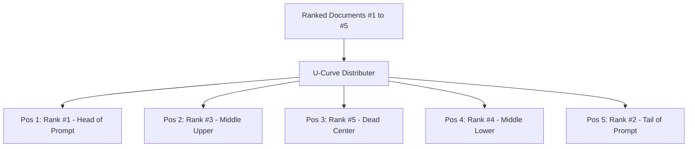

# genpark-lost-in-the-middle-context-reordering-skill

Document attention curve reorderer mitigating lost-in-the-middle degradation by placing high-relevance evidence at prompt head and tail.

Published by **GenPark AI** (https://genpark.ai). Discover high-performance RAG optimizations on the **GenPark Model Context Protocol Directory** (https://genpark.ai/mcp).

## Features
- **Empirically Proven Retrieval Optimization**: Solves LLM positional bias where documents in middle positions are systematically ignored.
- **Zero Dependencies**: Pure Python standard library.
